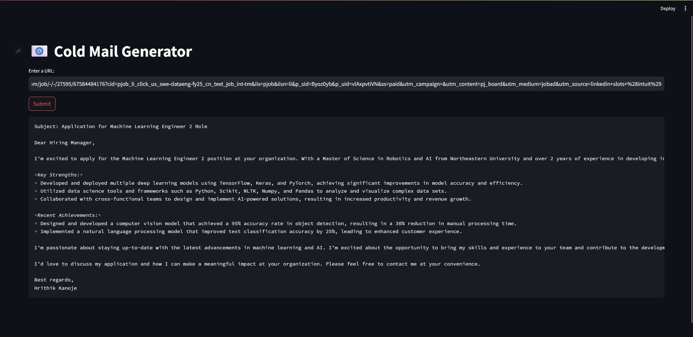

# 📧 LLM Powered Cold Email Generator Agent

This Agent is designed for job applicants to generate cold emails using Groq, Langchain, and Streamlit. Users can provide the URL of a company's careers page, from which the tool extracts job listings. It then generates personalized cold emails, incorporating portfolio links relevant to the job descriptions, sourced from a vector database.

**Example scenario:**

- Intuit is looking to hire a Machine Learning Engineer 2, investing significant resources in the hiring, onboarding, and training process.
- Hrithik, a Deep learning Engineer, can offer Intuit his technical skills and hand-on experince and he plans to send a cold email to Hiring Manager for this opportunity.



## Architecture Diagram


## Setup Instructions
1. First, obtain an API key from [Groq Console](https://console.groq.com/keys) and update the `GROQ_API_KEY` value in the `app/.env` file with your key.

2. Install the required dependencies by running:
   ```commandline
   pip install -r requirements.txt

3. Launch the Streamlit application by running:
    ```commandline
    streamlit run app/main.py
